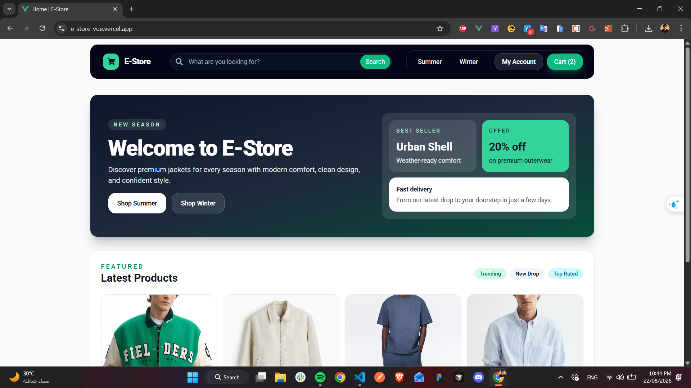
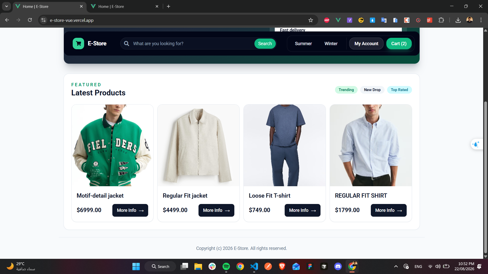
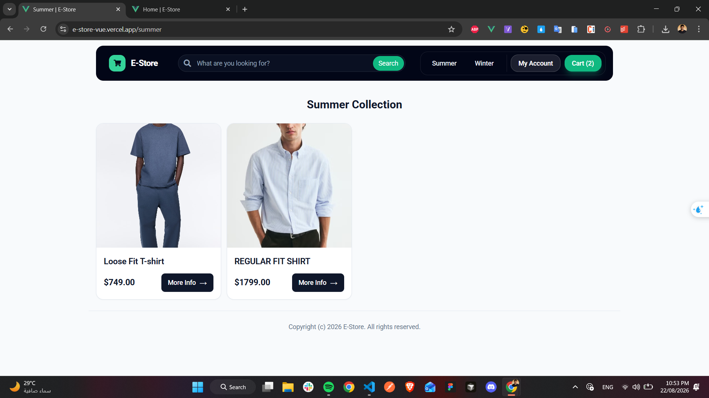
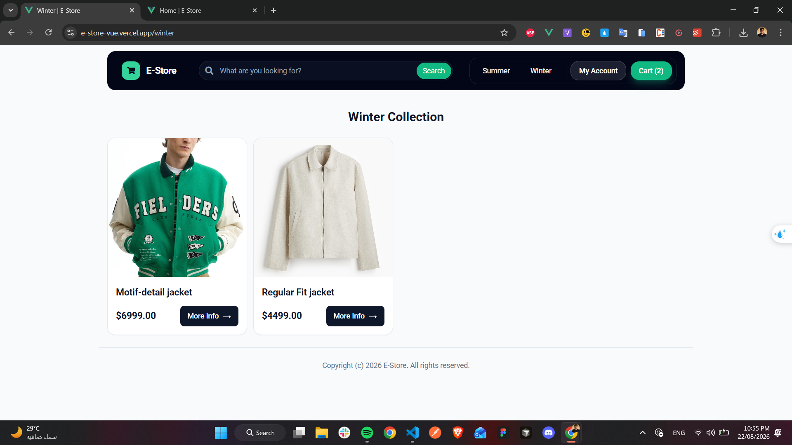
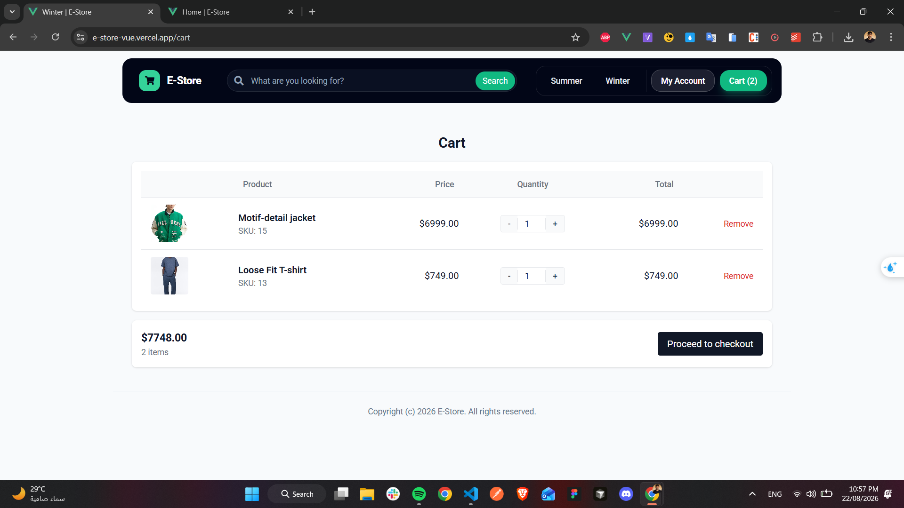
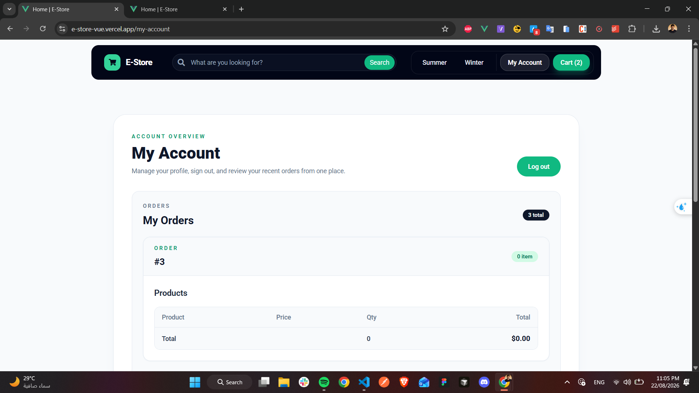
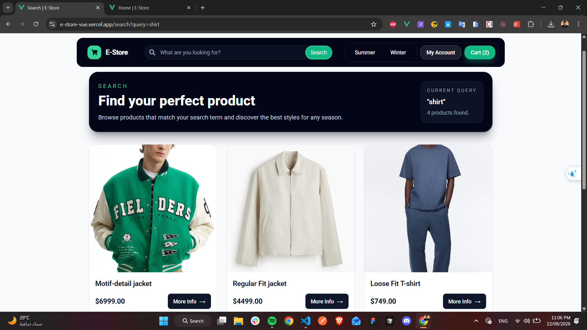
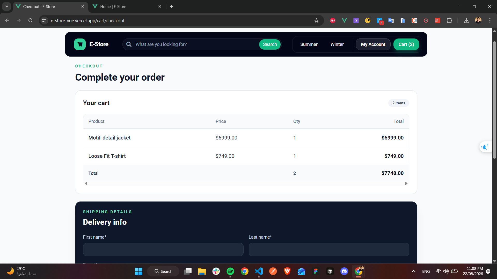
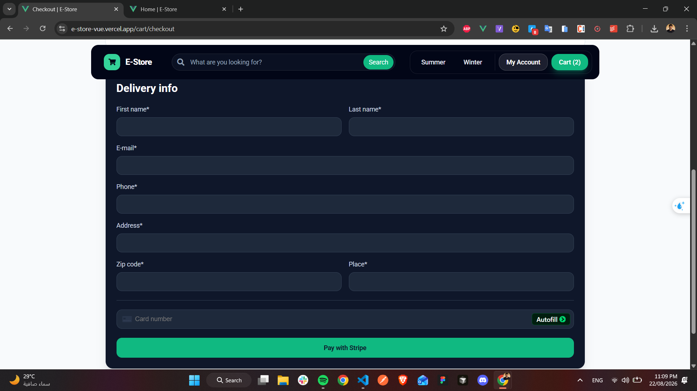
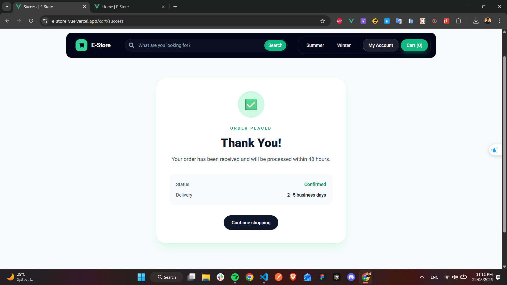

# 🛍️ E-Store — Vue.js E-Commerce Frontend

## 1. Project Overview

E-Store is a responsive Vue.js storefront for browsing and purchasing seasonal outerwear. This repository contains the frontend application: the user interface, client-side routing, Vuex state, cart experience, authentication flow, and Stripe checkout integration.

The frontend communicates with a separate Django REST Framework backend for product data, authentication, orders, and checkout processing.

## 2. 🚀 Live Demo

| Resource           | URL                                                                         |
| ------------------ | --------------------------------------------------------------------------- |
| Frontend           | [e-store-vue.vercel.app](https://e-store-vue.vercel.app/)                   |
| Backend API        | [e-store-django.onrender.com](https://e-store-django.onrender.com)          |
| Backend repository | [AhmedReda47/E-Store_django](https://github.com/AhmedReda47/E-Store_django) |

## 3. ✨ Key Features

- Browse the latest products and seasonal categories (`summer` and `winter`)
- View product details and add products to the cart
- Search the catalog through the header search form
- Persist cart contents in browser `localStorage`
- Register an account and log in with username and password
- Protect the account and checkout routes for authenticated users
- Review previous orders from the My Account page
- Update quantities, remove items, and view cart totals
- Complete checkout with shipping details and Stripe card tokenization
- Show order confirmation after a successful checkout
- Responsive desktop and mobile navigation and cart layouts
- Display loading indicators and success/error notifications during key actions

## 4. 🛠️ Tech Stack

The technologies below are declared in `package.json` or loaded by the application:

- **Vue 3** with Vue CLI 5
- **Vue Router 4** for client-side navigation
- **Vuex 4** for centralized state management
- **Axios** for HTTP requests
- **Tailwind CSS 3** for styling
- **Swiper** for UI content that uses the installed slider dependency
- **Stripe.js** loaded from `https://js.stripe.com/v3`
- **Babel**, **PostCSS**, **Autoprefixer**, and **Sass** for the build pipeline
- Font Awesome 5 and Google Fonts are loaded in `public/index.html`

## 5. 📁 Project Structure

```text
public/
└── index.html              # HTML shell and external Stripe/font/icon assets

src/
├── assets/                 # Application assets
├── components/             # Reusable layout and feature components
│   ├── AppFooter.vue
│   ├── AppHeader.vue       # Navigation, search, account and cart links
│   ├── AppLayout.vue       # Shared layout and loading indicator
│   ├── CartItem.vue
│   ├── OrderSummary.vue
│   ├── Popup.vue
│   └── ProductCard.vue
├── router/index.js         # Routes and authentication guard
├── store/index.js          # Vuex cart, token and loading state
├── styles/tailwind.css     # Tailwind directives
├── views/                  # Route-level pages
│   ├── AboutView.vue
│   ├── Cart.vue
│   ├── Category.vue
│   ├── Checkout.vue
│   ├── HomeView.vue
│   ├── LogIn.vue
│   ├── MyAccount.vue
│   ├── Product.vue
│   ├── Search.vue
│   ├── SignUp.vue
│   └── Success.vue
├── App.vue                 # Store initialization and root layout
└── main.js                 # Application bootstrap and Axios base URL

babel.config.js             # Babel configuration
jsconfig.json               # JavaScript settings and @/* alias
postcss.config.js           # Tailwind and Autoprefixer configuration
tailwind.config.js          # Tailwind content paths
vue.config.js               # Vue CLI configuration
package.json                # Dependencies and npm scripts
```

## 6. 🔐 Authentication

The sign-up page sends `username` and `password` to `POST /api/v1/users/`. The login page sends the credentials to `POST /api/v1/token/login/` and reads the returned `auth_token`.

After login, the token is stored in `localStorage` and Vuex. On application startup, the token is restored and Axios is configured with:

```http
Authorization: Token <auth_token>
```

The router redirects unauthenticated users from `/my-account` and `/cart/checkout` to `/log-in`, preserving the requested path in the `to` query parameter. Logging out clears the token and related local user values from `localStorage`.

## 7. 🛒 Shopping Cart

The Vuex store keeps cart items in `state.cart.items`. Each item contains a product object and quantity. Adding the same product increases its existing quantity; quantities can also be changed or removed from the cart page.

The cart is persisted under the `cart` key in browser `localStorage` and restored by the `initializeStore` mutation. The cart page calculates item count and total price locally. A successful checkout clears the cart.

## 8. 💳 Stripe Checkout

`Checkout.vue` uses Stripe.js to mount a Card Element, create a client-side Stripe token, and send that token with the shipping details and cart items to the Django backend at `POST /api/v1/checkout/`.

The frontend is responsible for collecting checkout details and tokenizing card data. The backend is responsible for validating the order, processing the payment with Stripe, and creating the order record. No Stripe secret key belongs in this repository.

The current implementation initializes Stripe with a test publishable key directly in `Checkout.vue`. Before using a production payment configuration, replace that setup with an appropriate deployment-safe publishable-key configuration and keep secret keys exclusively on the backend.

## 9. 🔌 API Integration

Axios is configured in `src/main.js` with the `VUE_APP_API_URL` base URL. Requests then use relative paths:

| Method | Path                                               | Frontend use                                       |
| ------ | -------------------------------------------------- | -------------------------------------------------- |
| `GET`  | `/api/v1/latest-products/`                         | Load products on the home page                     |
| `GET`  | `/api/v1/products/<category_slug>/`                | Load a category and its products                   |
| `GET`  | `/api/v1/products/<category_slug>/<product_slug>/` | Load product details                               |
| `POST` | `/api/v1/products/search/`                         | Search with a JSON `query` value                   |
| `POST` | `/api/v1/users/`                                   | Register a user                                    |
| `POST` | `/api/v1/token/login/`                             | Authenticate a user                                |
| `GET`  | `/api/v1/orders/`                                  | Load the authenticated user's orders               |
| `POST` | `/api/v1/checkout/`                                | Submit shipping data, cart items, and Stripe token |

## 10. 🌎 Environment Variables

Create a local `.env` file or configure the variable in the deployment environment:

```env
VUE_APP_API_URL=https://e-store-django.onrender.com
```

Vue CLI exposes variables prefixed with `VUE_APP_` to the frontend build. `.env` files containing local configuration should not include secrets committed to GitHub. The API URL is public application configuration; backend secrets and Stripe secret keys must remain on the Django/Stripe server side.

## 11. ⚙️ Installation & Local Development

### Prerequisites

- Node.js and npm
- A reachable instance of the Django REST API

### Setup

```bash
git clone https://github.com/AhmedReda47/E-Store_Vue.git
cd E-Store_Vue
npm install
```

Set `VUE_APP_API_URL` to your backend URL, then start the Vue CLI development server:

```bash
npm run serve
```

The development server normally runs at `http://localhost:8080`.

## 12. 🏗️ Production Build

Create the optimized production bundle with the script defined in `package.json`:

```bash
npm run build
```

Vue CLI writes the generated files to `dist/`.

## 13. 🚀 Deployment

The frontend is deployed on Vercel. A typical deployment uses the repository as the Vercel project source, installs dependencies, runs `npm run build`, and serves the resulting `dist/` output.

Configure `VUE_APP_API_URL` in Vercel’s environment settings so it points to the deployed Django API:

```env
VUE_APP_API_URL=https://e-store-django.onrender.com
```

After changing an environment variable, trigger a new deployment because Vue CLI embeds it during the build.

## 14. 🔗 Related Repository

The Django REST Framework backend is maintained separately:

[AhmedReda47/E-Store_django](https://github.com/AhmedReda47/E-Store_django)

## 15. 📸 Screenshots

### Homepage




### SummerPage



### WinterPage



### CartPage



### MyAccountPage



### SearchingPage



### CheckoutPage




### SuccessPage



## 16. 🧪 Testing / Code Quality

No test runner or lint script is currently defined in `package.json`. The available npm scripts are:

| Script          | Purpose                              |
| --------------- | ------------------------------------ |
| `npm run serve` | Start the Vue CLI development server |
| `npm run build` | Create the production build          |

## 17. 🔧 Troubleshooting

- **Requests fail or products do not load:** Check that `VUE_APP_API_URL` is defined before starting or building the app and that it points to a reachable Django API. Restart the development server after changing `.env` values.
- **Browser reports a CORS error:** The Django backend must allow requests from the frontend origin, including `http://localhost:8080` during local development and the Vercel production URL after deployment.
- **Protected pages redirect to login:** Confirm that login returned `auth_token`, that the token is present in browser `localStorage`, and that the request uses the `Authorization: Token <auth_token>` header.
- **Checkout is unavailable:** Checkout requires a non-empty cart and an authenticated user. Confirm that Stripe.js loads from `public/index.html` and that the configured publishable key matches the intended Stripe environment.
- **Payment succeeds in the UI but the order is not created:** Check the Django `/api/v1/checkout/` response and backend logs. Payment processing and order creation are handled by the backend.
- **Build fails after dependency changes:** Run `npm install` and retry `npm run build`. Review the first build error for the responsible dependency or source file.

## 18. 👨‍💻 Author

Ahmed Reda

## 19. 📄 License

No license has currently been specified for this repository.
